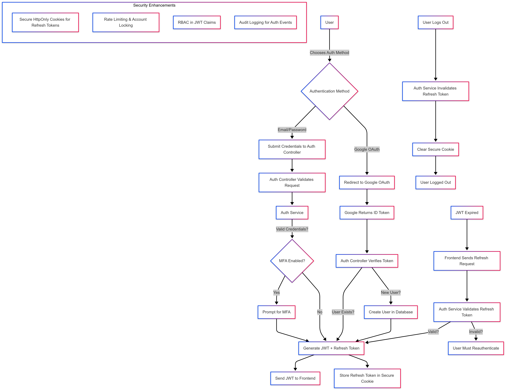

### **Authentication Flow for Startup Projects**  

#### **1. User Initiates Authentication**  
- The user selects one of the following authentication methods:  
  - **Email/Password Login**  
  - **Google OAuth Login**  

---

#### **2. Handling Email/Password Authentication**  
- **User submits email & password** to the `/login` API endpoint.  
- The **Auth Controller** forwards the request to the **Auth Service**.  
- The **Auth Service**:  
  1. Validates the email & password against the database.  
  2. If valid, it checks if MFA is enabled:  
     - If **MFA is enabled**, prompt for the second factor (e.g., OTP, authenticator app).  
  3. Generates a **short-lived JWT** (15–30 minutes) containing:  
     - `user_id`  
     - `email`  
     - `role` (optional for RBAC)  
     - `iat`, `exp` claims for security  
  4. Issues a **secure, HttpOnly refresh token** (stored in a secure cookie).  
- Response:  
  - JWT is sent in the response body for API authorization.  
  - Refresh token is stored in an **HttpOnly, Secure cookie** to prevent XSS attacks.  

---

#### **3. Handling Google OAuth Authentication**  
- The user selects **Google Login**, triggering a request to Google’s OAuth service.  
- Google returns an **ID token**.  
- The **Auth Controller**:  
  1. Verifies the Google ID token’s signature and expiry using Google's public keys.  
  2. Extracts the user’s email.  
  3. Checks if the email exists in the database:  
     - **If the user exists:** Issue a JWT and refresh token (same process as email login).  
     - **If the user does not exist:** Create a new user record in the database and issue tokens.  
- The frontend stores the JWT and refresh token as in the email/password flow.  

---

#### **4. Token Expiry & Refresh Mechanism**  
- JWTs are **short-lived (15–30 minutes)** to reduce risk.  
- When the JWT expires:  
  - The frontend automatically sends a request to `/refresh-token` with the refresh token (HttpOnly cookie).  
  - The **Auth Service** validates the refresh token:  
    - If valid, it issues a new JWT.  
    - If invalid/expired, the user must reauthenticate.  

---

#### **5. Logout Process**  
- The frontend sends a `/logout` request.  
- The **Auth Service**:  
  - Deletes the refresh token (if stored in a database).  
  - Clears the HttpOnly cookie.  
- The frontend removes the JWT from memory (if stored in a state management library).  

---

### **Security Enhancements**  
✅ Use **HttpOnly, Secure cookies** for refresh tokens to prevent XSS.  
✅ Enforce **Rate Limiting & Account Locking** after failed login attempts.  
✅ Implement **Role-Based Access Control (RBAC)** in JWT claims.  
✅ Add **Multi-Factor Authentication (MFA)** for added security.  
✅ Log authentication attempts for **audit & monitoring**.  

## Design Diagram
